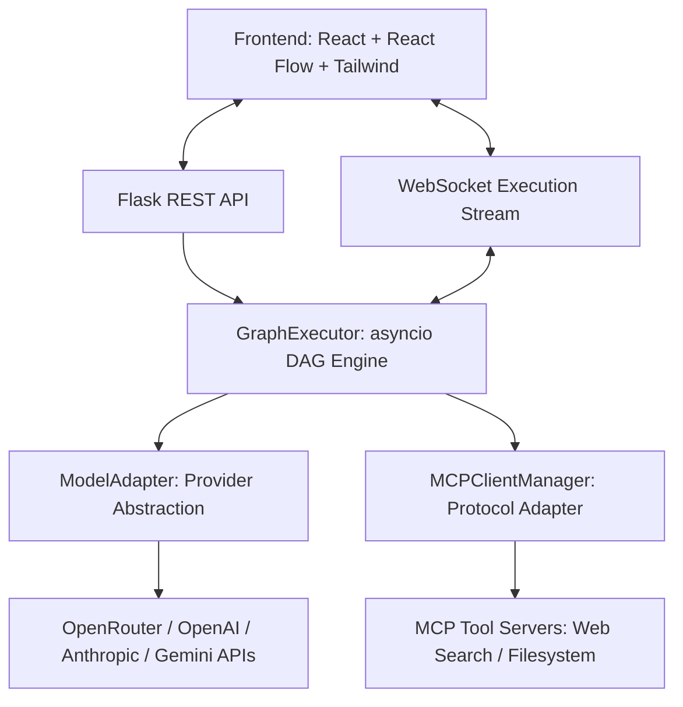

# AgentForge — Visual Multi-Agent Orchestration Platform

> **AgentForge** is a modern visual multi-agent orchestration platform that enables developers and researchers to design, wire, and execute complex AI agent pipelines on an interactive drag-and-drop canvas.

---

## Key Value Proposition

Most agent frameworks are code-only, opaque, or locked to a single LLM vendor. **AgentForge** makes agent orchestration visual, inspectable, and vendor-agnostic:
- **Visual Canvas**: Build multi-agent DAG graphs using drag-and-drop React Flow nodes.
- **Model-Agnostic Core**: Swappable LLMs per node (Llama 3.3 70B, GPT-OSS 20B, Gemini 2.0, DeepSeek R1, Claude, GPT-4o) via a unified `ModelAdapter` backed by OpenRouter free tier models.
- **Real MCP Tool Integration**: Connect Model Context Protocol (MCP) servers (live web search, filesystem, system info) to tool nodes with dynamic upstream prompt payload propagation.
- **Live Trace Streaming**: Real-time WebSocket broadcasting of intermediate reasoning, token streams, and tool executions pushed directly to canvas nodes and glowing edge lines.
- **Antigravity-Style Side Drawer**: High-resolution, expandable right-side output drawer with 1-click Markdown copy and export.

---

## Architecture & Component Overview



### Node Types Supported
| Node Type | Purpose | Configuration Options |
| :--- | :--- | :--- |
| **Agent Node** | LLM Reasoning & Prompt Generation | System prompt, Model ID, Provider, Temperature |
| **MCP Tool Node** | Real Model Context Protocol Execution | MCP Server (`web_search`, `filesystem`), Function (`fetch_job_postings`, `read_file`), Arguments |
| **Condition Node** | Dynamic Rule Evaluation & Branching | Expression rule evaluation (e.g. `output.contains("SUCCESS")`) |
| **Merge Node** | Parallel Fan-in Output Combination | Merge Strategy (`combine_dict`, `concat_text`, `wait_all`) |

---

## Quick Start Guide

### Prerequisites
- Python 3.10+
- Node.js 18+

### 1. Environment Setup
Create a `.env` file in the root directory (or in `backend/`):
```env
OPENROUTER_API_KEY=your_openrouter_api_key_here
PORT=5000
```

### 2. Backend Setup & Run
```bash
cd backend
python -m venv venv
# On Windows:
venv\Scripts\activate
# On macOS/Linux:
source venv/bin/activate

pip install -r requirements.txt
python app.py
```
*Backend runs on `http://localhost:5000` with WebSocket endpoint at `ws://localhost:5000/ws/execution`.*

### 3. Frontend Setup & Run
```bash
cd frontend
npm install
npm run dev
```
*Frontend canvas runs on `http://localhost:5173`.*

---

## Flagship Template: Company Research Agent Swarm

AgentForge includes a pre-built flagship multi-agent swarm template designed to research any target company or technology sector in parallel:

```
[Financial Analyst] ----------\
[News Intelligence] -----------\
[Competitor Intelligence] -------> (Synthesize Data Stream Merge Node) ---> [Executive Report Writer]
[Hiring Trends MCP Tool] -------/
```

1. **Financial Analyst**: Evaluates balance sheet health, revenue trajectory, and valuation multiples.
2. **News Intelligence**: Gathers recent headlines, press releases, and media sentiment.
3. **Competitor Intelligence**: Maps out key market rivals and competitive moats.
4. **Hiring Trends MCP Tool**: Invokes a real web-search MCP server to fetch active job postings and engineering signals.
5. **Synthesize Data Stream**: Merges all four incoming intelligence streams concurrently.
6. **Executive Report Writer**: Synthesizes all streams into a cohesive, 6-section Executive Board Brief.

---

## Repository Structure

```
AgentForce/
├── backend/
│   ├── orchestrator/
│   │   ├── graph.py         # DAG model: nodes, edges, validation
│   │   ├── executor.py      # Async DAG executor engine & event emitter
│   │   └── stream.py        # WebSocket execution trace broadcaster
│   ├── agents/
│   │   ├── base_agent.py    # Base agent class with streaming logic
│   │   └── model_adapter.py # Model-agnostic adapter (OpenRouter/OpenAI/Claude/Gemini)
│   ├── mcp/
│   │   └── mcp_client.py    # MCP client manager & stdio/HTTP tool invocations
│   ├── api/                 # Flask REST endpoints (workflows CRUD, run triggers)
│   ├── models/              # SQLAlchemy database models
│   └── app.py               # Main Flask entrypoint
├── frontend/
│   ├── src/
│   │   ├── canvas/          # React Flow canvas, Header, Sidebar, NodeInspector, OutputModal
│   │   ├── nodes/           # Node card components (AgentNode, ToolNode, ConditionNode, MergeNode)
│   │   ├── execution/       # Execution trace viewer & WebSocket client store
│   │   ├── templates/       # Prebuilt templates (Company Research Swarm, 2-Node Linear, MCP Tool)
│   │   ├── store/           # Zustand state management
│   │   └── api/             # REST API & WebSocket client
│   └── package.json
├── tests/                   # Pytest suite for graph executor, MCP client, and model adapter
└── README.md
```

---

## License

Built by Google DeepMind Antigravity Team. Distributed under the MIT License.
